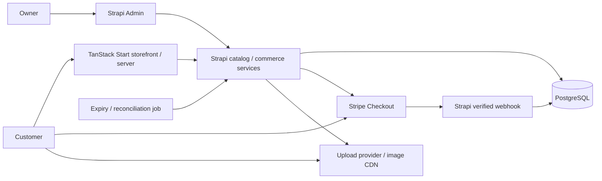

# Proposed architecture — approval required

## Understanding and discovery

A real mobile-first Thai fashion store, with editorial imagery, guest checkout, automatic PromptPay/card payment verification, and Strapi administration. Instagram is a one-time migration source only. No Instagram API, custom duplicate CMS, customer account system, or paid production deployment is needed at this stage.

Local project and remote Git repository had no existing files/refs during discovery. No installed dependencies existed. npm registry latest versions checked on 2026-10-05: TanStack Start 1.168.60, Query 5.104.1, Strapi 5.56.0, Stripe Node SDK 23.0.0. These are observations, not an approved compatible lockfile. Verify engines and peer dependencies together before installation. Local Node is 24.18.0; use npm.cmd on this Windows machine because PowerShell blocks npm.ps1.

Export is HTML, not JSON. Metadata exists in `your_instagram_activity/media/posts_1.html`, `posts.html`, and `profile_photos.html`; media paths are relative to the export root. There are 2,412 files under media, including content other than products. Export states its requested period is 2025-10-05 through 2026-10-05; older catalog coverage is not guaranteed. Profile photo is `media/other/17913162716888346.jpg`; `files/Instagram-Logo.png` is Instagram's icon, not the shop logo.

Sample captions describe secondhand remade crop shirts with individual measurements and a historical price of THB 200. Names repeat while dimensions differ. Do not merge by title or infer stock=1. Captions mention free Thailand shipping and international shipping by weight, but current policies need confirmation. Historical prices are draft evidence, not automatically current selling prices.

## Critical stack review

Keep requested TypeScript/React/TanStack Start/Router/Query, Strapi 5, PostgreSQL, Stripe. Start provides SSR and server functions; Query manages remote state with request-local SSR caches. Cart/selector state stays local. Strapi supplies catalog/admin, but commerce requires custom transactional services; generic CRUD does not provide safe checkout.

Strapi documents its transaction helper as experimental. Isolate stock transactions in one tested backend module, pin versions, and test against real PostgreSQL. Product draft/publish must not duplicate inventory records: catalog content may be versioned, inventory and operational commerce records must not use draft/publish. Do not use floating point currency: integer satang throughout.

Use hosted Stripe Checkout initially to reduce payment UI/security maintenance. The store collects shipping details before redirect. PromptPay is THB and requires an eligible Thai Stripe account; it presents a banking-app QR flow. Do not promise automatic app handoff on every phone; test paying from the same mobile device. Collect email for receipts and PromptPay refund communication. Stripe handles payment only.

## Architecture and proposed directory structure



```text
apps/storefront/          Start routes, SSR, Query, cart, checkout
apps/cms/                 Strapi schemas, commerce services, webhook, jobs
packages/contracts/       Shared validated public DTOs, money types
tools/instagram/          HTML extraction, draft review/import utilities
assets/brand/             Reviewed original brand assets
data/migration/drafts/    Private review output (ignored)
docs/                     Architecture, setup and launch runbooks
```

Browser gets sanitized published catalog and session-scoped order status only. Start server proxies checkout/status using server-only credentials; no unrestricted Strapi token reaches the browser. Strapi owns price validation, shipping calculation, stock, payment creation, webhook and state changes. Webhooks terminate directly at Strapi. Rate-limit checkout, validate all input, restrict CORS and redact customer data from logs.

## Data model

| Model | Core fields and rules |
| --- | --- |
| Product | name, unique slug, description, short description, category, collections, ordered media, SEO, condition, material, publication state, migration review state |
| Variant | unique SKU, product, optional color/size, actual garment measurements with units, integer priceSatang, active, optional specific image; each unique garment has its own SKU |
| Inventory | unique variant link, onHand, reserved; nonnegative constraints, reserved <= onHand; no draft/publish |
| Category / Collection | name, unique slug, description, ordered media, publication state |
| Order | opaque public reference, hashed access token, checkout idempotency key, currency=THB, subtotal/shipping/total, paymentStatus, fulfillmentStatus, contact/address snapshots, expiry, timestamps |
| OrderItem | order, SKU/variant link, immutable name/color/size/measurement/price snapshots, quantity, line total |
| Reservation | order, variant, quantity, expiry, ACTIVE/CONSUMED/RELEASED; uniqueness per order/variant |
| PaymentAttempt | order, unique Checkout session ID/PaymentIntent ID, amount/currency, status, idempotency key |
| StripeEvent | unique event ID, type, processing status, received/processed timestamps; minimum retained payload |
| InventoryMovement | variant, order if applicable, delta, reason, timestamp, staff identity when applicable |
| MigrationSource | source post identifier, caption/media hash, provenance, extraction evidence, review issues; private, not public API |

Guest contact/address belongs to the order snapshot; no Customer account entity needed for V1. Products can have a single purchasable variant without inventing S/M/L. Collections and category are distinct. Nullable unknown measurements/stock evidence remain NEEDS_REVIEW. Use unique indexes and CHECK constraints in controlled migrations, not only app validation.

Owner uses Strapi Admin for products/images/variants and orders. Inventory adjustments and fulfillment transitions must call safe services through small Admin extensions where required; do not permit editing payment status or reserved counts through ordinary forms. This is a limited Strapi extension, not a separate admin dashboard. Publication requires reviewed prices and explicit current inventory.

## API boundaries

- GET published product/collection DTOs with pagination, filters and responsive media metadata.
- POST checkout: variant IDs, positive integer quantities, customer/address, idempotency key only. Reject unknown fields; server loads published/active SKUs and current prices and computes shipping/totals.
- GET order status: authenticated by opaque guest access token; no sequential-ID lookup or exposed address data.
- POST Stripe webhook: raw request body and verified Stripe signature; no browser payment mutation.
- Internal stock adjustment, fulfillment and reconciliation: staff/service authorization only.

Query keys include normalized filters and product slug. Listing/detail may start with 60-second stale times, availability shorter; checkout always revalidates independently. Invalidate relevant availability/order queries after mutations. SSR uses separate QueryClient per request. Persist only variant IDs/quantities in the cart; refresh prices and handle sold-out/price-change states explicitly.

## Payment and inventory strategy

1. Normalize cart, combine duplicate SKUs, enforce quantity limits. In a PostgreSQL transaction, lock relevant inventory rows in stable SKU order, validate available = onHand - reserved, snapshot trusted prices, create PENDING_PAYMENT order and ACTIVE reservations, increment reserved atomically. Concurrent buyers cannot both reserve the final item.
2. Commit DB transaction before contacting Stripe. Create Checkout with deterministic idempotency key and THB totals. Persist Stripe IDs. A network timeout is an unknown outcome: retry/reconcile with the same key, never blindly release inventory or create a second payment session.
3. Align hold duration with supported Checkout expiry (initial proposal: 30 minutes, validate API constraints and PromptPay QR behavior before coding). Do not hold a database transaction while calling Stripe.
4. Signature-verified webhook validates account/test-vs-live context, stored session/order association, PaymentIntent, amount, currency and actual paid status. Handle successful immediate and asynchronous payment events as applicable; completed does not automatically mean paid.
5. In one transaction, lock order/reservations, persist unique event ID, update order to PAID once, consume reservations and decrement onHand/reserved once. Different events about the same payment also cannot double-decrement. A failed transaction leaves processing retryable; acknowledge only after durable processing.
6. On abandonment/timeout, expire or verify the Stripe session first. Release only when payment is definitively unpaid and can no longer succeed. A processing payment keeps its reservation pending reconciliation. Webhook, expiry and stock updates use the same locking/state rules. Duplicate releases are no-ops.
7. A persisted periodic job finds overdue reservations, unknown Stripe outcomes and unprocessed events. Retry temporary failures, expose unresolved cases to staff. Late unexpected successful payment after release must trigger a documented exception/refund workflow; never silently fulfill unavailable stock.
8. Payment/refund and fulfillment states remain separate. A refund alone does not restock; staff confirms returned stock through a recorded adjustment. A failed card attempt does not necessarily terminate a still-usable checkout.

No Redis/message broker needed initially. A Strapi cron job plus durable PostgreSQL records is sufficient if backend stays running. All jobs are safe to retry; production requires monitoring and backups. Test concurrency, duplicate/different Stripe events, signature rejection, price tampering, creation timeouts and expiry/payment races with PostgreSQL and Stripe test mode.

## Images and deployment proposals

| Images | Benefit | Cost/complexity tradeoff |
| --- | --- | --- |
| Cloudinary | Strapi provider plus transformations and responsive delivery | Simplest initial integration; storage/transform/bandwidth quotas must be measured against this catalog |
| Cloudflare R2 | S3-compatible storage; no direct egress charge | Image resizing/CDN delivery needs a separate solution and possibly separate cost; do not equate R2 with an image optimizer |
| AWS S3-compatible | Official Strapi S3 provider, broad compatibility | CDN/transform setup and provider request/egress pricing need separate evaluation |

Recommend Cloudinary for easiest V1 implementation, conditional on catalog size and monthly traffic fitting budget. R2 is the alternative if recurring image costs outweigh additional setup. Keep Strapi upload provider configurable; store media references, not provider-specific transformations in commerce records. Commit reviewed originals/brand files as requested, strip metadata from public derivatives, generate responsive WebP/AVIF/JPEG sizes. Do not commit all raw media or use repository storage as the production upload backend. Large selected asset sets may require Git LFS with its own limits/cost.

Lowest operational complexity: one small paid VPS with reverse proxy, Start Node server, Strapi and PostgreSQL, object storage externally. Tradeoff: developer manages security updates, backup/restore and single-host downtime. Alternative: frontend on a compatible low/free Start host, always-on managed Strapi and managed PostgreSQL. Easier maintenance, typically higher recurring cost. Avoid sleeping backend tiers for live checkout/webhooks. Do not choose exact plans or promise a monthly total before budget, traffic, storage and backup requirements are known. Verify official prices at deployment selection; no paid provisioning now.

## Migration and design

Parse actual HTML boundaries, media links, captions and timestamps. Inspect duplicate representations in posts.html/posts_1.html and deduplicate using source identity/media hashes. Only consider public post/reel/profile assets; exclude messages, contacts, account/security/advertising data. Group photos only with evidence; repeated generic names are insufficient. Extract prices, material and measurements with source references, flag conflicting/unknown fields NEEDS_REVIEW. Never invent stock, availability, size labels or current price. Draft import is idempotent and private; owner reviews before any publication.

Design: off-white/black, generous spacing, editorial hero and restrained two-column mobile grids. Home, shop, collection, image-dominant product detail, bag, guest checkout and order-status pages. Use original brand icon after confirmation. Render primary product content with SSR, meaningful alt text, accessible variant controls, visible focus, proper errors, canonical/OG metadata, published-only sitemap and factual Product structured data. No guessed best-seller ranking or fabricated campaign claims. Responsive image dimensions prevent layout shifts; hero/LCP image loads eagerly, below-fold images lazily.

## Scope and phased roadmap

**MUST HAVE V1:** published catalog, categories/collections, SKU inventory, mobile storefront, cart, guest address/contact, trusted checkout totals, shipping policy, PromptPay/cards, secure/idempotent webhooks, safe reservations/reconciliation, Strapi management, draft migration, brand icon, basic SEO/accessibility, test/live separation, backups and launch verification.

**SHOULD HAVE:** optimized responsive image derivatives, inventory adjustment history, order notification email, payment exception visibility, minimal search/filtering, error monitoring and scheduled restore drills.

**LATER:** accounts, loyalty, reviews, coupons, recommendation engine, international checkout with confirmed shipping/tax rules. No Instagram synchronization planned.

1. Discovery/architecture: this plan, answer business questions, approve architecture.
2. Foundation: explain/install compatible pinned dependencies, workspace, strict TS, env examples, PostgreSQL development workflow, Start and Strapi skeleton.
3. Catalog/commerce: content types, safe inventory services, storefront pages/cart; tests for stock concurrency.
4. Checkout: shipping, Stripe test mode, reservations, raw-body webhook verification, reconciliation and failure tests.
5. Migration: HTML tooling, provenance-rich drafts, review UI/output, confirmed import; no automatic publication.
6. Polish: editorial/mobile, image performance, SEO, accessibility and end-to-end checkout checks.
7. Production: approved hosting, secrets, eligible Stripe account, domain, monitoring, backup restore test and explicit launch checks.

## Confirmed business rules

- Each physical garment is unique and has exactly one unit. Model it as its own Product with one purchasable SKU; do not combine garments just because captions share a title. Color and actual measurements describe that garment; do not invent selectable size/color alternatives. Initialize current sellable inventory only after the owner confirms that the garment is still available; one unit per item does not establish that every historical post remains unsold.
- Thailand domestic shipping is a flat THB 30 (3,000 satang) added to the garment subtotal. Proposed interpretation: per order, subject to owner confirmation. Server computes this charge and snapshots it in the order. Historical free-shipping captions must not override this confirmed current policy.
- Prevent concurrent payment for the same unique garment through atomic reservation. No multi-unit stock-management UI is needed; availability and reservation consistency remain required.

## Questions before implementation

- Resolved: every physical garment has one unit. Still needed: which historical exported products remain available today?
- Resolved: owner confirmed `igh.ess` as the displayed brand name and approved the profile image as logo/icon.
- Confirm THB 30 is per order rather than per garment; confirm Thailand-only V1 and current returns/contact policy.
- Does the owner have an eligible Thai Stripe account? What is the monthly infrastructure budget?
- Confirm architecture before major code generation, as explicitly requested in the supplied brief.

## Official references consulted

- https://tanstack.com/start/latest
- https://tanstack.com/query/latest/docs/framework/react/overview
- https://docs.strapi.io/cms/database-transactions
- https://docs.strapi.io/cms/features/media-library
- https://docs.stripe.com/payments/promptpay
- https://docs.stripe.com/api/checkout/sessions/expire
- https://cloudinary.com/pricing
- https://developers.cloudflare.com/r2/pricing/
- Design reference: https://dribbble.com/shots/25441478-Fashion-Ecommerce-Website-Design
